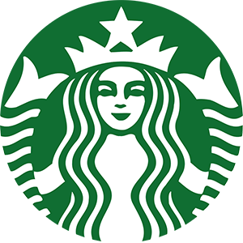

# ☕ Starbucks Clone

Projeto desenvolvido como exercício prático para treinar HTML e CSS, recriando a interface da página inicial do Starbucks.

## 📸 Demonstração



## 🚀 Tecnologias Utilizadas

* **HTML5:** Estruturação semântica da página.
* **CSS3:** Estilização, uso de Flexbox/Grid para layout e responsividade.
* **Git & GitHub:** Versionamento de código.

## 🎯 Objetivos do Projeto

- [x] Recriar o layout fielmente ao original.
- [x] Praticar o posicionamento de elementos com CSS.
- [x] Manipular imagens e assets.
- [x] Publicar o projeto no GitHub.

## 📂 Como rodar o projeto

1. Clone o repositório:
   ```bash
   git clone [https://github.com/miguelzufelatto/starbucks.git](https://github.com/miguelzufelatto/starbucks.git)
